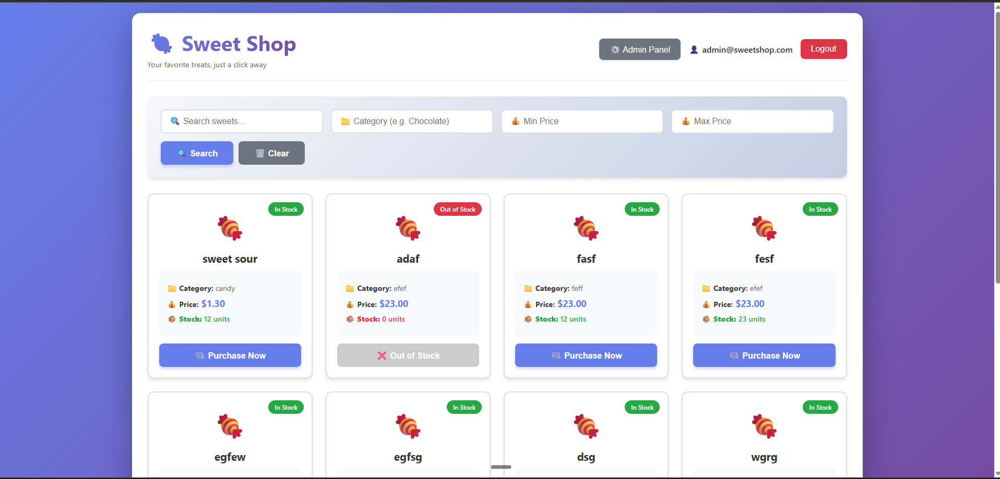
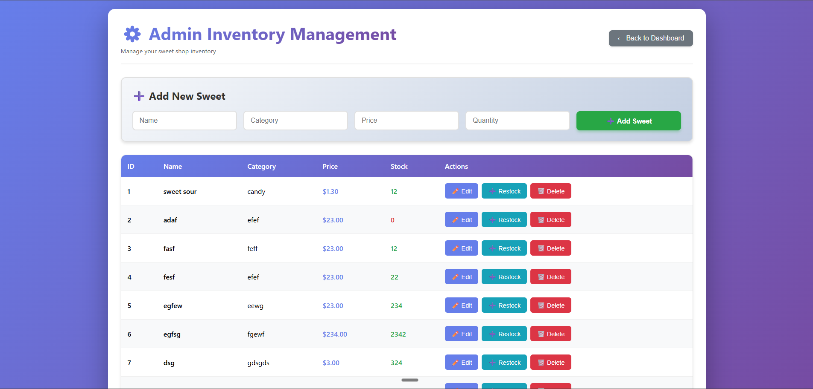

# TDD Kata: Sweet Shop Management System

A full-stack application for managing a boutique sweet shop's inventory and sales. Built with **FastAPI** (Backend) and **React + Vite** (Frontend), following **Test-Driven Development (TDD)** principles.

## 🎯 Project Overview

This system provides:

- **Customer Features:**
  - Browse and search sweets by name, category, or price range
  - Purchase sweets (automatically decreases inventory)
  - Real-time stock availability indicators

- **Admin Features:**
  - Add, update, and delete sweets
  - Restock inventory
  - Full CRUD operations on product catalog

- **Security:**
  - JWT-based authentication
  - Role-based access control (Admin vs. Regular User)
  - Protected API endpoints

## 🛠️ Tech Stack

### Backend
- **Framework:** FastAPI
- **Database:** SQLite (with SQLAlchemy ORM)
- **Migrations:** Alembic
- **Authentication:** JWT (python-jose) + Password Hashing (passlib)
- **Testing:** Pytest + pytest-cov
- **API Documentation:** Auto-generated OpenAPI/Swagger docs

### Frontend
- **Framework:** React 18
- **Build Tool:** Vite
- **Routing:** React Router
- **HTTP Client:** Axios
- **State Management:** React Context API

## 📋 Prerequisites

- **Python 3.9+**
- **Node.js 18+** and npm
- **Git**

## 🚀 Setup Instructions

### Backend Setup

1. **Navigate to the backend directory:**
   ```bash
   cd backend
   ```

2. **Create a virtual environment:**
   ```bash
   py -m venv venv
   ```

3. **Activate the virtual environment:**
   - **Windows (PowerShell):**
     ```bash
     venv\Scripts\Activate.ps1
     ```
   - **Windows (Command Prompt):**
     ```bash
     venv\Scripts\activate.bat
     ```
   - **macOS/Linux:**
     ```bash
     source venv/bin/activate
     ```

4. **Install dependencies:**
   ```bash
   cd app
   pip install -r requirements.txt
   ```

5. **Create environment file:**
   Create a `.env` file in the `backend/app/` directory:
   ```env
   DATABASE_URL=sqlite:///./sweetshop.db
   SECRET_KEY=your-secret-key-here-change-in-production
   ALGORITHM=HS256
   ACCESS_TOKEN_EXPIRE_MINUTES=30
   ```

6. **Run database migrations:**
   ```bash
   alembic upgrade head
   ```

7. **Create an admin user (optional):**
   ```bash
   cd ..
   python scripts/create_admin.py
   ```

8. **Start the development server:**
   ```bash
   cd app
   uvicorn main:app --reload
   ```

   The API will be available at `http://localhost:8000`
   - API Documentation: `http://localhost:8000/docs`
   - Alternative docs: `http://localhost:8000/redoc`

### Frontend Setup

1. **Navigate to the frontend directory:**
   ```bash
   cd frontend
   ```

2. **Install dependencies:**
   ```bash
   npm install
   ```

3. **Create environment file:**
   Create a `.env` file in the `frontend/` directory:
   ```env
   VITE_API_BASE_URL=http://localhost:8000
   ```

4. **Start the development server:**
   ```bash
   npm run dev
   ```

   The frontend will be available at `http://localhost:5173` (or another port if 5173 is occupied)

## 🧪 Running Tests

### Backend Tests

From the `backend/app/` directory:

```bash
# Run all tests
pytest

# Run tests with coverage report
pytest --cov=app --cov-report=html

# Run specific test file
pytest tests/test_auth.py
pytest tests/test_sweets.py
```

The coverage report will be generated in `htmlcov/index.html`

## 📝 API Endpoints

### Authentication
- `POST /api/auth/register` - Register a new user
- `POST /api/auth/login` - Login and receive JWT token

### Sweets (Protected)
- `GET /api/sweets` - Get all sweets (with optional search query)
- `GET /api/sweets/search` - Search sweets by name/category
- `POST /api/sweets` - Create a new sweet (Admin only)
- `PUT /api/sweets/{id}` - Update a sweet (Admin only)
- `DELETE /api/sweets/{id}` - Delete a sweet (Admin only)

### Inventory
- `POST /api/sweets/{id}/purchase` - Purchase a sweet (decreases quantity)
- `POST /api/sweets/{id}/restock` - Restock a sweet (Admin only)

## 🔐 User Roles

- **Regular User:** Can browse, search, and purchase sweets
- **Admin:** Full access including CRUD operations and inventory management

To create an admin user, use the script:
```bash
python scripts/create_admin.py
```

## 📸 Screenshots

The following screenshots showcase the application in action:

### 1. Login Page

*User authentication interface with email and password fields*

### 2. Dashboard - Sweet Catalog

*Main dashboard displaying all available sweets with search and filter capabilities*

### 3. Search & Browse Functionality

*Search interface allowing users to filter sweets by name, category, or price range*

### 4. Admin Panel

*Admin interface for managing sweets inventory, including add, update, delete, and restock operations*

## 🧪 Test Coverage & Test Report

The project follows **Test-Driven Development (TDD)** with comprehensive test coverage. All tests follow the Red-Green-Refactor cycle, ensuring code quality and reliability.

### Test Suite Overview

- **Integration Tests:** Full API endpoint testing with in-memory database
- **Authentication Tests:** User registration, login, token validation
- **Business Logic Tests:** Purchase flow, inventory management, role-based access
- **Edge Cases:** Out-of-stock purchases, unauthorized access attempts, not found scenarios

### Test Statistics

To generate a test report, run:

```bash
cd backend/app
pytest --cov=app --cov-report=html --cov-report=term
```

The HTML coverage report will be available in `htmlcov/index.html`, showing:
- Total test count
- Coverage percentage
- Line-by-line coverage details
- Uncovered code sections

### Test Categories

**Authentication Tests (`test_auth.py`):**
- User registration with valid/invalid data
- User login with correct/incorrect credentials
- JWT token generation and validation

**Sweets Management Tests (`test_sweets.py`):**
- Create sweet (Admin only)
- Update sweet (Admin only)
- Delete sweet (Admin only)
- Restock sweet (Admin only)
- Get all sweets (Public)
- Search sweets by name, category, price range
- Purchase sweet (decreases inventory)
- Out-of-stock purchase prevention
- Unauthorized access attempts (403 Forbidden)
- Not found scenarios (404)

All tests use an in-memory SQLite database for fast, isolated test execution.

## 🏗️ Project Structure

```
sweet-shop-kata/
│
├── backend/
│   ├── alembic/              # Database migrations
│   ├── app/
│   │   ├── routers/          # API endpoints
│   │   ├── tests/            # Test suite
│   │   ├── main.py           # FastAPI application
│   │   ├── models.py         # Database models
│   │   ├── schemas.py        # Pydantic schemas
│   │   ├── auth.py           # JWT & password hashing
│   │   └── database.py       # SQLAlchemy setup
│   ├── scripts/
│   │   └── create_admin.py   # Admin user seeding
│   └── requirements.txt
│
└── frontend/
    ├── src/
    │   ├── api/              # Axios configuration
    │   ├── components/       # Reusable UI components
    │   ├── pages/            # Page components
    │   ├── context/          # React Context (Auth)
    │   └── App.jsx           # Router setup
    └── package.json
```

---

## 🤖 My AI Usage

**Transparency Statement:** This project was developed with the assistance of AI tools. All AI-assisted commits have been properly attributed with co-author tags as per the project requirements. The following section details how AI tools were integrated into my development workflow.

### AI Tools Used

1. **Gemini (Google)** - Used for planning, architecture design, and brainstorming
2. **Cursor IDE (AI-powered editor)** - Used for code generation and implementation

### How AI Was Used Throughout Development

**Important Note:** While AI tools were used extensively throughout the development process, I personally architected and managed all steps myself. I ensured that all code follows SOLID principles and maintains high quality standards. Every piece of AI-generated code was reviewed, understood, and modified to fit the project's requirements and my coding standards.

#### 1. Architecture & Planning Phase (Gemini)
- **API Design Planning:** Used Gemini to brainstorm RESTful API endpoint structures, request/response schemas, and authentication flow patterns. This helped me think through edge cases and design a robust API architecture before implementation.
- **Database Schema Design:** Consulted Gemini to validate database relationships, model structures, and indexing strategies for the User and Sweet models. I then refined the design to ensure optimal performance and maintainability.
- **TDD Workflow Planning:** Gemini assisted in structuring the test-first approach, helping me identify which tests to write first and plan the sequence of Red-Green-Refactor cycles. I used this as a starting point and expanded it with comprehensive test cases.

#### 2. Code Generation & Implementation (Cursor)
- **Boilerplate Generation:** Used Cursor's AI to generate initial FastAPI router structures, Pydantic schemas, and SQLAlchemy model definitions. I then refactored and enhanced this code to ensure it follows SOLID principles and project-specific requirements.
- **Component Creation:** Leveraged Cursor's inline AI suggestions to scaffold React components (SweetCard, Toast, ProtectedRoute, etc.) with proper prop structures and initial JSX skeletons. I then customized these components to match the design requirements and ensure proper functionality.
- **Configuration Files:** Cursor's AI generated initial Alembic configuration, CORS middleware setup, and environment variable handling patterns. I reviewed and adjusted these configurations to ensure security and best practices.

#### 3. Test-Driven Development (TDD)
- **Test Case Planning (Gemini):** Used Gemini to brainstorm comprehensive test scenarios, including edge cases like:
  - Concurrent purchase attempts (race conditions)
  - Invalid token scenarios
  - Out-of-stock purchase validation
  - Admin-only endpoint access control
  - Not found scenarios (404 errors)
  - Unauthorized access attempts (403 Forbidden)
- **Test Implementation (Cursor):** Cursor's AI helped structure `conftest.py` with proper database fixtures, test client setup, and isolation patterns. I then expanded the test suite with comprehensive test cases covering all endpoints and edge cases.
- **Test Data Generation:** AI suggested realistic test data patterns for sweets (names, categories, prices) that made tests more readable. I refined these to ensure test coverage of various scenarios.

#### 4. Problem Solving & Debugging (Cursor)
- **Error Resolution:** When encountering SQLAlchemy session management issues, Cursor's AI helped diagnose and fix database session lifecycle problems. I then reviewed the solutions to ensure they followed best practices.
- **JWT Implementation:** Used Cursor to verify JWT token encoding/decoding logic and token expiration handling. I ensured the implementation was secure and followed industry standards.
- **CORS Configuration:** Cursor's AI assisted in properly configuring CORS middleware to allow frontend-backend communication. I reviewed the configuration to ensure it was secure and not overly permissive.

#### 5. Code Quality & Refactoring (Cursor)
- **Code Review & SOLID Principles:** After writing initial implementations, I used Cursor's AI to review code for:
  - SOLID principle adherence (Single Responsibility, Open/Closed, Liskov Substitution, Interface Segregation, Dependency Inversion)
  - Potential security vulnerabilities
  - Performance optimizations
  - Code duplication opportunities
- **Refactoring Assistance:** Cursor's AI suggested consolidating repeated authentication logic into reusable dependency functions in `dependencies.py`. I then refined this to ensure proper separation of concerns and maintainability.

#### 6. Frontend Development (Cursor)
- **React Patterns:** Consulted Cursor on best practices for:
  - Context API state management patterns
  - Protected route implementation with React Router
  - Axios interceptor configuration for automatic token attachment
  - Form validation and error handling patterns
- **UX Improvements:** Cursor's AI suggested user feedback mechanisms (loading states, success/error messages) that improved the overall user experience. I implemented these with proper error handling and user-friendly interfaces.

#### 7. Documentation (Cursor)
- **README Writing:** Used Cursor's AI to structure this README, ensuring clarity and completeness of setup instructions. I then customized it to accurately reflect the project structure and requirements.
- **Commit Messages:** Cursor's AI helped craft clear, descriptive commit messages that followed conventional commit standards. All commits include proper co-author attribution where AI was used.

### Reflection on AI Impact

**Positive Impacts:**
- **Acceleration:** AI tools significantly reduced time spent on boilerplate and repetitive code, allowing me to focus more on business logic, architecture decisions, and comprehensive test coverage.
- **Learning:** Using AI as a coding partner helped me discover modern patterns and best practices (e.g., FastAPI dependency injection, React Context patterns) that I might not have encountered otherwise.
- **Quality:** AI-assisted code reviews helped identify potential bugs and security issues early, leading to more robust code. However, I personally ensured all code follows SOLID principles and maintains high quality standards.
- **TDD Discipline:** AI helped maintain TDD discipline by suggesting test cases before implementation, keeping the Red-Green-Refactor cycle consistent. I expanded these suggestions into comprehensive test suites.

**My Approach:**
- **Architecture & Management:** I personally architected and managed all development steps, ensuring the project structure follows best practices and SOLID principles.
- **Code Ownership:** Every piece of AI-generated code was reviewed, understood, and modified to match my coding style, project requirements, and quality standards. No code was blindly copy-pasted.
- **SOLID Principles:** I ensured all code adheres to SOLID principles:
  - **Single Responsibility:** Each module, class, and function has a single, well-defined responsibility
  - **Open/Closed:** Code is open for extension but closed for modification
  - **Liskov Substitution:** Derived classes can be substituted for their base classes
  - **Interface Segregation:** Interfaces are specific and focused
  - **Dependency Inversion:** High-level modules depend on abstractions, not concrete implementations
- **Comprehensive Testing:** I created extensive test cases covering all endpoints, edge cases, and error scenarios, ensuring high test coverage and reliability.

**Challenges & Mitigations:**
- **Over-reliance Risk:** I made a conscious effort to understand every AI-generated piece of code before integrating it, ensuring I could debug and maintain it independently.
- **Code Quality:** I reviewed all AI suggestions against SOLID principles and project requirements, making necessary modifications to ensure code quality and maintainability.

**Conclusion:**
AI tools (Gemini for planning and Cursor for code writing) were integral to this project's development, serving as powerful assistants that enhanced productivity. However, I maintained full control over the architecture, code quality, and implementation decisions. All code follows SOLID principles and maintains high standards of quality, testability, and maintainability. The transparency in AI usage and co-authorship attribution ensures accountability and demonstrates responsible use of modern development tools.

---

## 📄 License

This project is part of a TDD Kata exercise and is for educational purposes.

## 🙏 Acknowledgments

- Built following TDD principles with Red-Green-Refactor cycles
- Developed with AI assistance (Gemini & Cursor) as documented above
